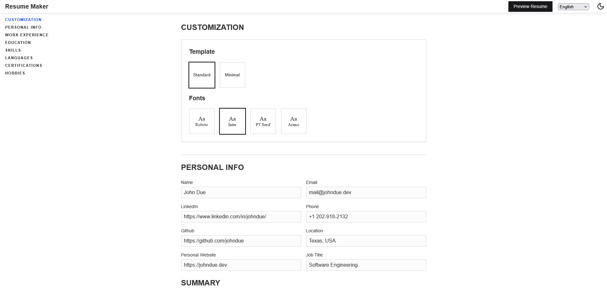

# Resume Maker 

## Resume Maker - Create Your Professional Resume Today!

Create a professional resume quickly and easily with our Resume Maker app. Choose from various templates, personalize your information, and download your resume.

## Future Implementations

- [x] **Projects Section**
- [ ] **Courses Section**
- [ ] **More Templates**
- [x] **Better mobile support**
- [ ] **Additional Language Support**
- [ ] **Cover Letter**

## How to Contribute

We welcome contributions! If you have suggestions or improvements, feel free to fork the repo and submit a pull request.

## Contact

Have questions or feedback? Feel free to reach out:

- GitHub Issues: [Report an Issue](https://github.com/jcggraca/resume-maker/issues)
- Email: mail@joaograca.dev

## License

This project is licensed under the [MIT License](LICENSE).
