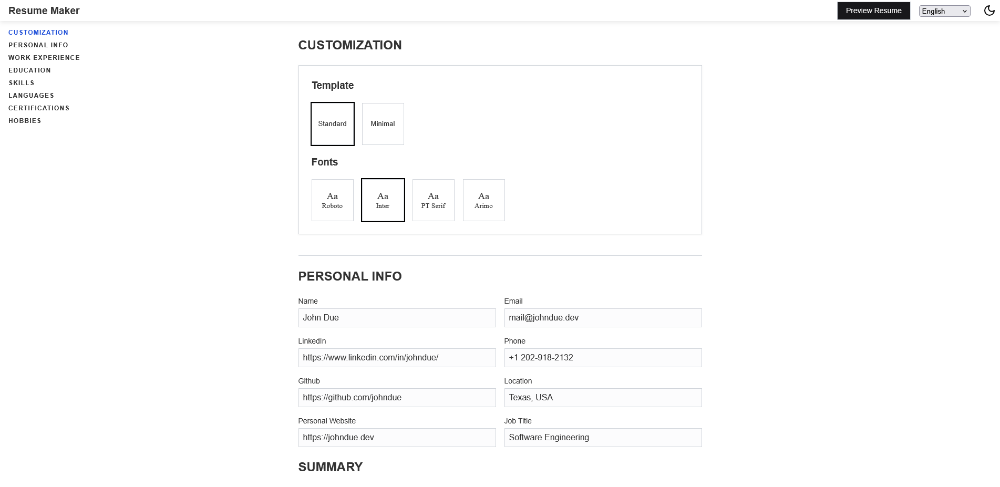

# Resume Maker 

## Resume Maker - Create Your Professional Resume Today!

Create a professional resume quickly and easily with our Resume Maker app. Choose from various templates, personalize your information, and download your resume.



## Getting Started

Clone the repository:

```
git clone https://gitlab.com/jcggraca/portfolio.git  
cd portfolio
```

Install dependencies:

`npm install`

Run the development server:

`npm run dev`

## Build

Create a production build:

`npm run build`

Preview locally:

`npm run preview`

## How to Contribute

We welcome contributions! If you have suggestions or improvements, feel free to fork the repo and submit a pull request.

## Contact

Have questions or feedback? Feel free to reach out:

- GitHub Issues: [Report an Issue](https://github.com/jcggraca/resume-maker/issues)

## License

This project is licensed under the [MIT License](LICENSE).
